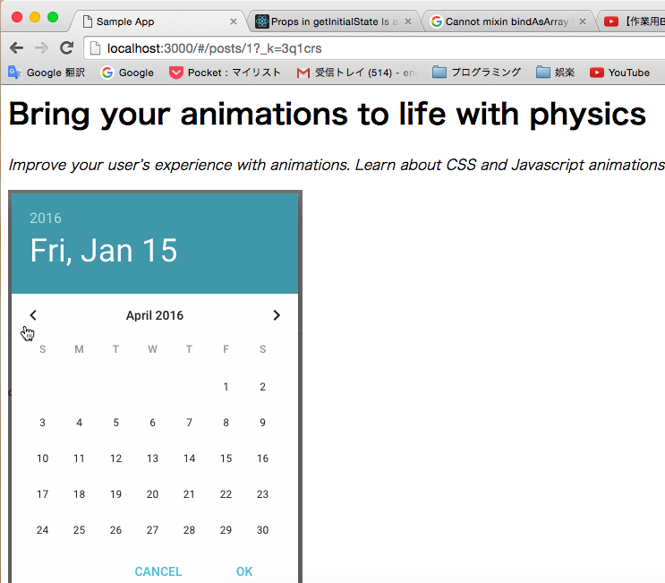

# ブログシステム
## フェーズ０:環境
- webpack
- react
- react-router
- material-ui

## フェーズ１:ボイラープレート
webpack+reactの雛形をgithubからcloneしました。
https://github.com/gaearon/react-hot-boilerplate

webpack + react開発の醍醐味の一つである、hot-reloadがなされていることを確認します。

Before


After


## フェーズ２:ルーティング
この段階でもっとも基本的なルーティングを定義します。
```
/ => <Home />
/posts => <PostList />
/posts/:_id => <Post />
```
各コンポーネントの説明
- Home  
記事一覧へのリンク
- PostList  
記事一覧
- Post  
記事のshow画面

コード
```
<Router history={browserHistory}>
  <Route path="/" component={Index}>
    <Route path="/posts/:postId" component={Post}/>
    <Route path="/posts" component={PostList}/>
    <IndexRoute component={Home}/>
  </Route>
</Router>
```

`/`にアクセス


`/posts`にアクセス


`/posts/:postId`にアクセス


まずは`/posts`から

記事一覧を表示するcomponentを定義します。名前は`PostList`にします。同時に記事そのものを格納したcomponents`Post`を定義。

```
<Router history={browserHistory}>
  <Route path="/" component={PostList}>
    <Route path="/posts" component={PostList}/>
  </Route>
</Router>
```

`/posts`にアクセスしたとき。


`/posts/:_id`にアクセスしたとき、そのIDを`<Post />`に渡します。

## フェーズ３:テストデータの投下。
バックエンドとして、今回はFirebaseを使用。Flux的な設計を想定していましたが、時間の都合上container-componentsスタイルで作ります。バックエンドはFirebaseを使用しました。
投下するサンプルデータ


```
//Post.js
export default class Post extends Component {
  constructor(props) {
    super(props);
    this.state = {post:{}};
  }
  componentWillMount() {
    let ref = new Firebase(`https://tks-blog.firebaseio.com/posts/${this.props.params.postId}`);
    this.bindAsObject(ref, "post");
  }
  render() {
    return (
      <div>
        <h1>{this.state.post.title}</h1>
        <p><i>{this.state.post.headline}</i></p>
        </img>
        <p>{this.state.post.body}</p>
      </div>
    );
  }
}
reactMixin(Post.prototype,ReactFireMixin)
```
es6ではmixinを使えず、モジュールを使ってfirebaseのmixinをロードしました。

/postsにアクセス時。記事のタイトルを一覧


/posts/1にアクセス時。記事と記事の画像・本文が表示されています。


## フェーズ4:MaterialUIの投下
このままではあまりにも侘しいので、デザインを投下します。デザインの設計にはいくつかのパターンがありますが、今回はもっともMaterialUIっぽさがでるCardベースで作りました。


flexboxを使用しているため、画面のサイズに合わせて自動でリサイズがおこなわれます。

## フェーズ5:ユーザログインの実装
Twitterログインを使用します。


ログインのメソッドはFirebaseを使用します。
ログイン時、ユーザのサムネイルが表示されるようにします。


```
// LoginButton.js
render() {
  if(this.state.isLogin == false){
    return (
      <RaisedButton label="LOGIN" onClick={this.handleLogin}>
        <FontIcon className="muidocs-icon-custom-github" />
      </RaisedButton>
    );
  }else{
    return (
        <div>
          <Avatar src={this.state.user.twitter.cachedUserProfile.profile_image_url} />
          <RaisedButton label="LOGOUT" onClick={this.handleLogout} />
        </div>
    );
  }
}
```
isLogin属性により、レンダリングする値をswitchしています。

## フェーズ6:フォーム画面の作成
新規作成/編集どちらでも使えるようにFormComponentsを作成します。
`/posts/:postId/edit`にアクセス時は編集画面に

`/posts/new`にアクセス時は新規編集に

統一されたインターフェイスで削除、編集、新規作成全てを実装しました。

## フェーズ7:UserとPostを紐付ける
記事とユーザの画像を表示しました。

データ構造ですが、理想はリレーションで紐付けるのがベストです。しかし時間の都合上、埋め込み型を採用しました。

データの美しさは損なわれましたが、ユーザ情報の変更がなければこちらのほうがシンプルかつ迅速に実装できることに気づきました。

## フェーズ8:validationの作成
現状では誰でも記事の編集、削除が行えますが、それを規制します。


```
if(ref.getAuth().uid === post.autor.uid){
  switchEditButton = (
    <Link to={`/posts/${post[".key"]}/edit`}>
      <FlatButton label="EDIT" onClick={this.handleReadMore.bind(this)}/>
    </Link>
  );
}
```
